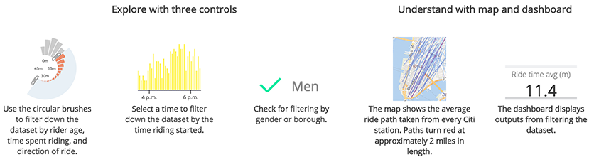
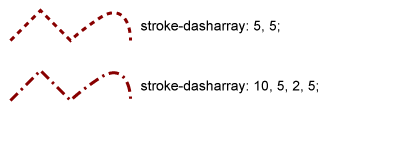

Citibike dataset explorer
===============

The Citibike explorer is a general-purpose visualization dashboard setup to display rides on New York City's public bikeshare system. The visualization is set up to show the rides for July 17, 2014, the busiest day of use of the service to date.

### Sourcing and data analysis

```js
var rides = crossfilter(data),
all = rides.groupAll(),
	     
hour = rides.dimension(function(d) { return d.minuteonbike; }),
hours = hour.group(),

gender = rides.dimension(function(d) { return d.gender; }),
genderCheck = rides.dimension(function(d) { return d.gender; }),
gendersAvg = gender.group().reduce(reduceAddGender, reduceRemoveGender, reduceInitialGender).all()

```

[django-boundaryservice](https://github.com/newsapps/django-boundaryservice)

### Other data sets


[django-boundaryservice](https://github.com/newsapps/django-boundaryservice)

```js
cCharts = [
	circleChart()
		.dimension(duration)
		.group(durations)
		.chartName('duration')
		.label(['0m','15m','30m','45m'])
```

```js
 barChart()
  .dimension(hour)
  .group(hours)
  .tickFormat(formatTimeofDay)
  .barwidth(2)
  .tickF([0,24,48,72,96,120,144,168,192,216,240,264,288]
	)
	.y(d3.scale.linear().range([80, 0]))
	.x(d3.scale.linear()
  .domain([0,288])
  .rangeRound([0, 288*3]))
```

```js
data.forEach(function(t, i){
	t['minuteonbike'] = +t['timeminutes'];
	t['timeonbike'] = +t['tripdurationintervals'];
	t['ageonbike'] = +t['ageintervals'] - 7;
	t['degrees'] = +t['degrees'];
});
```

### Modules

https://source.opennews.org/en-US/articles/animating-maps-d3-and-topojson/



Native Leaflet Lat/long conversion to x,y

Useful function for building a bounding box from an array of coordinates that can be passed into `d3path.bounds()`
```js
function reformat(array) {
                var data = [];
                array.map(function (d, i) {
                    var j = d.length;
                  for (i=0;i<j;i++){
                    data.push({
                        id: i,
                        type: "Feature",
                        geometry: {
                            coordinates: [+d[i].lo, +d[i].lat],
                            type: "Point"
                        }
                    });
                  }
                });
                return data;
            }
```

